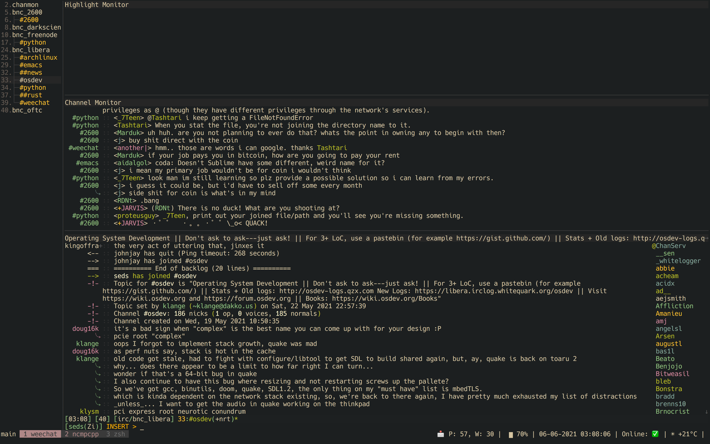

## Installing this configuration

### Requirements

- Chezmoi
- Archlinux or OSX

### Installing

**Note:** You are required to use the `env` variable `SECRETS_OFF=1`, as not passing will
make chezmoi fail when connecting to my bitwarden's account.

The following environment variables can be set to configure Chezmoi on runtime:

- `ASK`: Set to `1` if you want to enable chezmoi prompt
- `SECRETS_OFF`: Set to `1` to enable Bitwarden (uses my personal secrets set in
  .chezmoi.yaml)
- `DOTFILES_MINIMAL`: Set to `1` if you want to install the minimal version
- `WORKCONF`: Set to `1` to enable work configuration (work email, etc)

Chezmoi allows easy install of this configuration by running the following
command:

#### Full version

```shell
SECRETS_OFF=1 chezmoi init https://github.com/benmezger/dotfiles.git -S ~/dotfiles
```

#### Minimal version

The minimal version installs only the essentials.

- zsh
- git
- vim
- emacs
- tmux
- curl
- alacritty
- neovim
- user-dirs
- editorconfig
- dircolors

```shell
SECRETS_OFF=1 DOTFILES_MINIMAL=1 chezmoi init https://github.com/benmezger/dotfiles.git -S ~/dotfiles
```

## Scripts

All the system dependencies are installed either by running the
[Makefile](./Makefile) (see `make help`) or by running `chezmoi apply`. All
scripts are located in the [scripts](./scripts/) directory. Two files are of
importance: [buildcheck.sh](./scripts/buildcheck.sh) and
[minimalcheck.sh](./scripts/minimalcheck.sh). The first checks if the scripts is
running in a `CI` environment while the latter checks if the install profile is
equal to minimal.

## Keybindings

### OSX

- `fn + cmd - e` - opens emacs
- `fn + cmd - i` - opens firefox
- `fn + cmd - f` - opens finder in $HOME
- `cmd + return` - opens alacritty

#### MPC

- `fn + cmd - f1` - mpc play
- `fn + cmd - f2` - mpc pause
- `fn + cmd - f3` - mpc prev
- `fn + cmd - f4` - mpc next
- `fn + cmd - f5` - mpc volume -10
- `fn + cmd - f6` - mpc volume +10

## Troubleshooting

### Chezmoi does not seem to reload the configuration

Run `chezmoi init <dotfiles-path>` again. This should reload the configuration
by copying [chezmoi.yaml](.chezmoi.yaml.tmpl) to `$HOME/.config/chezmoi/chezmoi.yaml`.

### Sourcing env with i3

For some reason, i3 is sourcing `.xprofile` instead of `xinitrc`, so for
getting Github plugin for the [i3status-rust](dot_config/i3/status.toml) you need to set up a variable in
your `.xprofile`

```shell
export I3RS_GITHUB_TOKEN="your-github-token"
```

## Screenshots

### OSX


### Archlinux


### Weechat IRC



### Emacs


